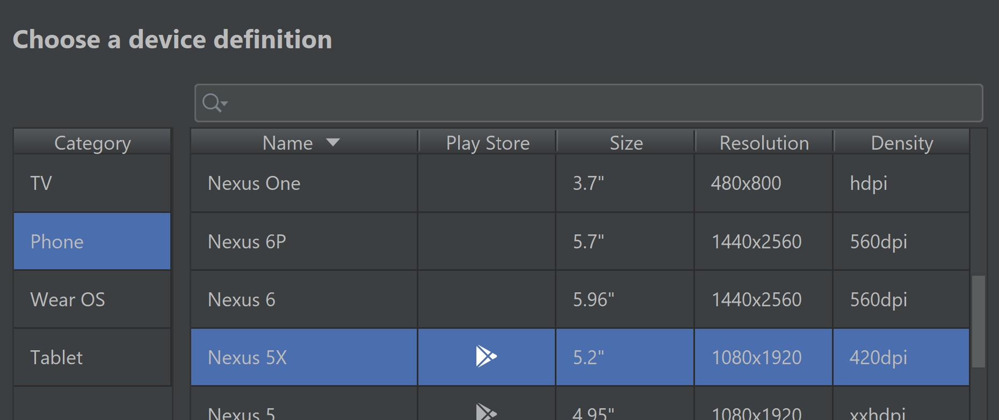

# CA326 - 3rd Year Project

Tom Callaghan (16449672)

Karl Duignan (16105982)

# 0. Table of contents

  

 - 0 Table of contents
    - 1 Introduction
     
     - 1.1 Overview
     
     - 1.2 Glossary
  - 2 System Architecture
     
     - 2.1 System Architecture Diagram
     
     - 2.2 System Architecture Overview
   - 3 Development and Testing
     
     - 3.1 Platforms
     
      - 3.2 Available Devices
     
      - 3.3 Functionality Changes
     
      - 3.4 Initial vs Current Architecture
     
      - 3.5 Testing
- 4 High-Level Design
     
    - 4.1 Class Diagram
     
    - 4.2 Component Diagram
     
    - 4.3 Use Case Diagram
     
    - 4.4 Data Flow Diagram
- 5 Problems and Resolution
- 6 Installation Guide
     
	-  6.1 Required Software
     
	- 6.2 Android
     
    - 6.3 iOS

  
  

# 1. Introduction

## 1.1 Overview

Receiptless is an application built for iOS/Android mobile devices which will help users in organising their expenses and storing their receipts in a more convenient way then tightly packing them into their purses/wallets.

Each user will have their own account which will be registered with their email and password. Users will not be able to use the application unless they verify their email at sign up. Once signed up the user will receive a confirmation code by email to verify. Once verified the user will have full access to the application.

The user is then able to scan their physical receipt and start the process. Once the user scans the receipt, the process of OCR and text processing is used to gather the necessary data. After the process is finished the user is given the option to view all receipts, this is done through a number of HTTP requests sent to our DynamoDB.

An expense tracker is also available which will allow the user to track their expenses. This gathers information from the receipts on the account as well as allows for the users own input. This information will be presented through graphs. There is also a calendar-based tracking system to pick and date and see the corresponding receipts. The user also has the option to send an expense report to their email.

## 1.2 Glossary

OCR Optical Character Recognition

AWS - Amazon Web Services

Data Processing - the collection and manipulation of items of data to produce meaningful information

HTTP - Hypertext transfer protocol

ePOS - Electronic Point of Sale

JEST - JavaScript Testing Framework

Pytesseract -  A python wrapper for google's Tesseract-OCR

  

AWS S3 bucket - blob storage service supplied by AWS

  

AWS Textract - OCR supplied by AWS

  

React Native - open-source mobile application framework created by Facebook

# 2. System Architecture

## 2.1 System Architecture Diagram

  

## 2.2 System Architecture Overview

  

The above diagram shows the full operational environment. The backend is made up of many different AWS cloud services. Originally, the app was going to be run using an EC2 instance, but due to the scalability of the app, a serverless option was chosen. The use of a serverless architecture allows the app to scale at a much higher level and reduces the cost.

  
  

AWS Cognito

Cognito is used to assist with the verification and authentication of users. The user information post signs up stored in a user pool. Cognito allows us to pass through a number of props such as username and email through our application through a Cognito token.

  

API Gateway

An API gateway is the centre of operations of the architecture of the application. It handles all HTTP requests from the client-side. On each API call Gateway invokes a lambda function in order to handle the process.

  
  

Lambda Function

Lambda functions are event-driven. They are invoked by API calls and in this application is also triggered by events in the S3 bucket. This architect has 5 lambda functions covering the following different processes:

-   Upload Image
    
-   OCR / Data Processing / Add to DB
    
-   Delete Receipt
    
-   Trigger SES
    
-   Get Image
    

  

S3 Bucket

S3 bucket is blob storage for different types of objects. In this current application, it is used as a data lake in order to store and retrieve images at different stages. There is a trigger set in the s3 bucket that when a “.jpg” file is added it will invoke the OCR lambda.

  

DynamoDB

DynamoDB is a NoSQL database. This is a very scalable service at a low cost. The application database stores the necessary receipt information under the user’s sub ID that we get from the Cognito token.

  

AWS SES

SES is a Simple Email Service that is used to send information from the app to the user’s email. It is triggered by a lambda function.

  

AWS CloudFormation

Cloudformation is used to keep a structure within the application’s architecture. Each service or function contains a cloud formation template to display the interactions with other components.

  
  

# 3. Development and Testing

## 3.1 Platforms

Over the development of the application, the aim was to make it a multi-platform application. Another of the struggles were met during development as a result of this aim. We were successfully able to complete the application on both iOS and Android platforms. React Native has built-in functionality to calculate screen resolution which allows us to adjust the CSS with percentages.

## 3.2 Available Devices

The application is available on all ranges of mobile devices that use iOS and Android platforms. React Native helped a lot with the development of both platforms. Whenever functionality or design changes were made the app was tested on both iOS and Android devices, with various different screen sizes.

## 3.3 Functionality Changes

Overall, the development did not bring much functionality changes to the originally planned functionality. The main functionality staged the same as specified in the functional spec. One functionality specification we had to drop was the use of a QR code to send the receipt data straight from the ePOS system to the phone. This had to be dropped as we could not get permissions to any ePOS APIs. This is something we would like to look into in future development.

## 3.4 Initial vs Current Architecture

The main change from our initial planned architecture was the change to serverless. This decision was made as it is a beneficial way for an application to scale in the future. It also lowered the cost as you only pay for what you use in serverless architectures.

## 3.5 Testing

Over the course of the development, many tests were done. The main methods of testing we used were:

-   Unit testing (JEST)
    
-   User testing
    
-   Acceptance testing
    
-   Heuristic Evaluations (Schneidman’s Eight Golden Rules)
    
-   Accessibility testing
    

More information on the testing that was performed can be found in the testing folder on our GitLab and the __test__ scripts in the code folder on the GitLab.

# 4. High-Level Design

## 4.1 Class Diagram

The above diagram demonstrates the structure of classes in Receiptless. In it shows each class/component we used in the development in the application and attributes such as variables names and functions within each one. Each class we used relates to a screen within the Application. All functionality of each screen is stated in the above diagram and how one class may interact with another.

## 4.2 Component Diagram

The above is a component diagram which shows each screen which may be encountered and the functionality that is within that screen. The arrows indicate how one may navigate through the application from screen to screen. As you can see Home Screen is linked to all screens. All screens also contain a sign out functionality throughout the application.

## 4.3 Use Case Diagram

  

The Use Case Diagram illustrated above gives a simple breakdown of what actions will/can occur between all outside elements of the application such as the user, DynamoDB database and the S3 Bucket. For example, the user may Scan a receipt, this, in turn, uploads the image of the receipt from the application to the S3 Bucket.

## 4.4 Data Flow Diagram

The above data flow diagram did not change much compared to our functional specification. The only change we really had to make was that of taking out the QR code scanning functionality we thought may have been implemented within the application. Aside from that the above diagram demonstrates how our data may flow/proceed throughout the application and gives a breakdown where data may be sent.

# 5. Problems and Resolution

This section should include a description of any major problems encountered during the design and implementation of the system and the actions that were taken to resolve them.

  

#### Camera Crashing

A major problem we faced was when we first began implementing the RNCamera was that it seemed to crash when we moved away from originally being on the camera screen. The camera would load perfectly upon the first load and visit the camera screen. The problem then occurred when navigating to another screen and returning to the camera screen. The camera would stay on a black screen and nothing else would happen. We discovered this was due to the camera process on the phone still running and in use from the first visit to the camera screen and any subsequent visits would result in the app believing the camera was still in use from another application. The way we resolved this issue was adding an on focus state to the component. This allowed us to tell the camera screen that when it is navigated away from that it can unmount the camera being used.  
  
#### Different Receipt Formats

A problem which we encountered and we anticipated beforehand was how there is a vast amount of ways receipts may be formatted. We knew from everyday experience receipts from different stores, restaurants, coffee shops etc. vary in how they are displayed on paper, what information is provided and even how certain information is worded. An example of this would be how one receipt may say “TOTAL” while another may use the words “Amount due”. To resolve this issue we decided that a majority of the receipts we were using for testing used the keyword “total” or “total due” therefore we decided for the time being to narrow down the applications ability to only work on receipts which included these keywords.

  

#### OCR Libraries Inconsistent

When we first began with our project we initially started out with using pytesseract. The first stage of testing on simple 3-word images yielded good results yet when we began getting into more complicated, noisier and unclear images of text, it began to produce very poor results. We also noticed that when it came to receipts, the order in which the OCR ran in pytesseract and how it outputted its results meant it was very difficult to read and parse the information and text we required. To resolve this we began testing other OCR libraries. We then came across AWS Textract. As we tested Textract we discovered it was far more accurate than pytesseract and also created a table around the recognised text which meant that all information was in the correct expected order it should be.

  
  
  

#### Platform Differences

From the outset of the development, we had planned to make this application multi-platform. The application is now available on iOS and Android. Throughout the development, a huge number of issues occurred with iOS development as Android is more open-source development. There are much more restrictions and rules within iOS. In order to resolve these issues, whenever any functionality was added, it had to be tested and validated on both platforms. For example, with Android in order to get permissions to the devices camera two lines of code had to be added to the android file, in contrast to that with iOS, permissions had to be added to the code as well as settings being changed in Xcode.

  

#### Various Screen Resolutions

As the application is used across two different platforms and a countless number of different size devices, the screen resolution had to be taken into account. At the beginning of the development, we originally tested on an iOS phone only. We soon became aware this was not a good idea. We then started to run the application on a number of different sized screen sizes and Android devices. We became aware that React Native had functionality built in that you could import and check the screen size and also the platform you are running on. You can then style and size by percentages to fit to the given screen.

  

#### No access to ePOS API

The applications initial specification we had planned to get access to a store’s ePOS system API. Unfortunately, due to store policies they were not allowed to release this information with us. This was a problem that unfortunately could not be resolved, as it was out of our hands.

  

#### Other Problems

There were many more problems that were encountered during development. For more information on these problems and how they were resolved, please visit our blog that is linked in the GitLab.

# 6. Installation Guide

Due to the fact, our application requires the use of a camera for the scanning of receipts, it is necessary to use an actual physical phone instead of an emulator. Emulators only have access to the webcam on windows laptops. This will lead to poor quality images and can affect the OCR. The application will run successfully on the emulator but you will not be able to take a picture of a receipt.

## Required Software

-   React native
    
-   Node.js
    
-   Android / iOS Device
    
-   xCode
    
-   Android Studio
    
-   Git
    

  

## Android

-   Open a terminal and navigate to a directory of your choice.
    
-   Once in the chosen directory type the commands “git clone https://gitlab.computing.dcu.ie/callagt4/2020-ca326-tcallaghan-receiptless.git”
    

-   Once this has finished cloning cd into the “Receiptless” folder.
    
-   In the “Receiptless” folder run the following command “npm install”. This will download all the necessary dependencies.
    
-   Once the action has completed cd into the android folder.
    
-   Within the android folder run the command “gradlew clean”. This will clean the cache and ensures it will run a fresh build.
    
-   Download and install Android Studio
    
-   After this has completed cd back into the “Receiptless” folder and follow one the instructions below depending on your choice
    

  

#### Emulator

-   Open up Android Studio.
    
-   Choose Configure→AVD Manager.
    
-   Click Create a Virtual Device.
    
-   Select Phone→Nexus 5X  
    
    
-   Click Next and then select X86 images and select a "Q API level 29” and press next  
    
    
-   Choose Portrait startup orientation and press Finish.
    
-   Once it’s done, at the main AVD manager page click the green play button beside your newly created android emulator. This should start up the emulator.
    
-   Once it is up and running cd back into the “Receiptless folder” on the command line.
    
-   Once inside the folder type the commands “react-native run-android”. This should begin an application build and a metro server. After a little while, the application should be installed and running on your android emulator.
    

  

#### Device

-   Make sure your android phone is connected to your laptop/pc by USB.
    
-   Make sure the android phone connected is in developer mode and USB debugging is enabled:
    

-   Go to 'Settings > About' phone/tablet and touch Build number 7 times. This will enable developer mode.
    
-   Once enabled go to 'Settings > Developer' options and enable USB debugging
    

-   If you run “adb devices” in your terminal your device should now appear as an attached device.
    
-   Navigate back to the “Receiptless” folder and then execute the terminal commands, “react-native run-android”. This should begin an application build and a metro server. After a little while, the application should be installed and running on your android mobile device.
    

  
  

## iOS

-   Open a terminal and navigate to a directory of your choice.
    
-   Once in the chosen directory type the command 

    

  

  

-   Once this has finished cloning, cd into the “Receiptless” folder.
    
-   In the Receiptless folder run the following command, “npm install”. This will download all the necessary dependencies.
    
-   Once this action is completed, cd into the ios folder and run the following command “pod install”.
    
-   Next step is to open Xcode.
    

  

#### Emulator

-   Once Xcode opens successfully, open the “.xcworkspace” file from the “Receiptless/ios” folder.
    
-   In order to run on an emulator open the device tab at the top of the page. Select the iOS device you would like to run on.
    

  

  

-   Click the play button to then run the app on the emulator you have selected.
    

  

#### Device

-   Once xCode opens successfully, open the “.xcworkspace” file from the “Receiptless/ios” folder.
    
-   In order to run on your device open the device tab at the top of the page. Select the iOS device you would like to run on.
    

  

  

-   Click the play button to then run the app on your device.
    
-   When installing the application on your device you will be prompted to go into your settings to trust the application.
    

-   Go to Settings > General > Device Management > Apple Development > Click “Trust App”.
    

-   You will then be shown the screen below. The app should now display on your device and to get started simply click on the app.
    

  

  
  

As a result of great feedback from the users that tested the application, as a team, we have decided to release the app to the public. We are currently working on publishing this application on the Google Play Store and App Store. This is a long process with many policies and restrictions, so, unfortunately, were not able to complete the publishing before the submission date of the project.
