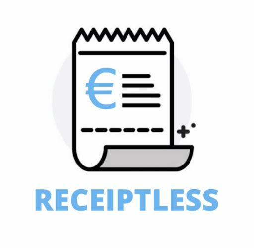
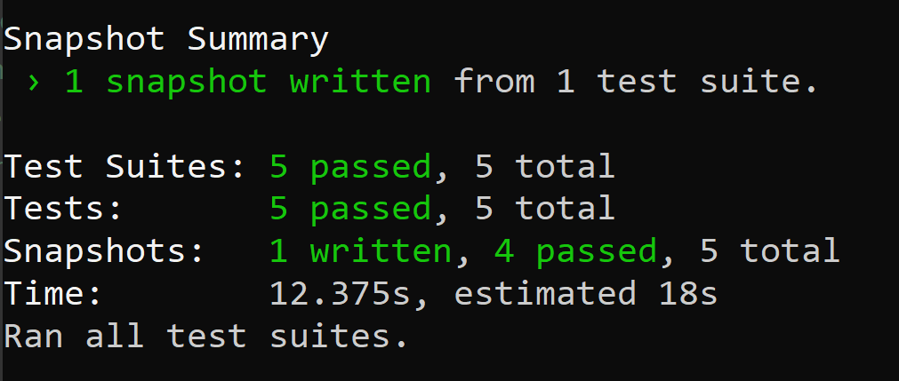
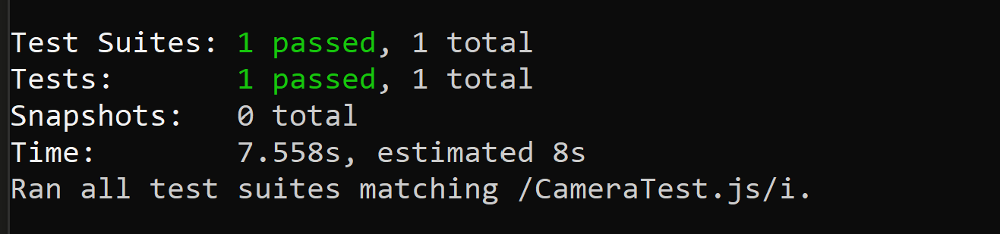
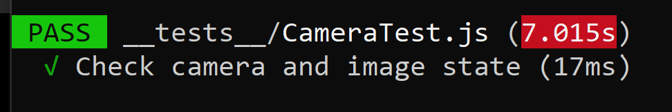
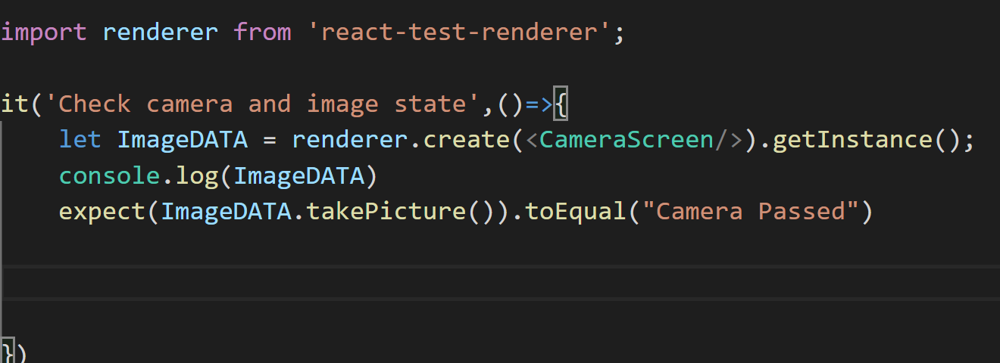
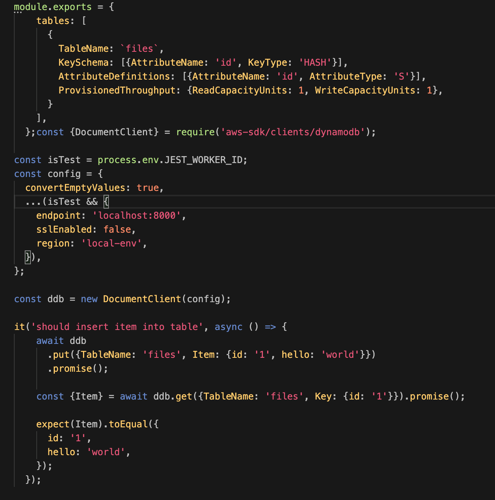



# Testing Document

### CA326 - 3rd Year Project

Tom Callaghan (16449672)

Karl Duignan (16105982)

## Overview

In this document we will run through all testing methods used throughout the development of the Receiptless application. To view all our unit tests, please visit the "__tests__" folder inside our "Receiptless" folder on the gitlab. The methods we used were User testing, Unit testing, Heuristic, Platform / Integration testing and Accessibilty testing. Unit testing was used to find all bugs with the dvelopment and enusred all our core functionality ran with no errors. User testing and Platform / Integration testing was a huge benefit to us as we were able to gather direct feedback from the user on design and bugs.

## User Testing (Ethics Approval)

A number of user tests were performed at the end of the development of the application. The test was performed on family members and other students between the ages of 18-55. Before any user testing could be done, we had to fill out an ethics form and get it approved by DCU. After getting users to test out the app we gave them a feedback form to fill out. The link to the form can be found below.

  

The overall consensus was that the app was designed very nicely but had a few bugs. These bugs were addressed once we received the feedback. The bugs consisted of;

-   No receipt displayed if the date was not on receipt
    
-   Receipt deleted with any confirmation (user deleted receipts by accident)
    
-   Sign out button broken
    
-   The calendar was not displaying anything when no receipts on that day (error handling)

-   The OCR took approx. 17 seconds which made some users inpatient. In order to fix this we refracted some of our code and altered our backend.
    

  

Overall, as this application is aimed for this target market of 18-60 year olds, so we tested accordingly. We took into account all feedback and adjusted the app to fulfil all requirements. During user testing we refered to the use cases we created in our functional spec, to ensure we have covered every use case in the app.

  

Link to form: [https://docs.google.com/forms/d/e/1FAIpQLScoqg9xQLgBWP161w0TYoF_4DP4H30_RFzoDUGNtKkRgURdMg/viewform](https://docs.google.com/forms/d/e/1FAIpQLScoqg9xQLgBWP161w0TYoF_4DP4H30_RFzoDUGNtKkRgURdMg/viewform)

  

## Unit Testing

For our unit testing, we used the javascript testing framework Jest. This was recommended by React and came pre-installed in the react native project.

  

We began by applying some basic rendering tests to each page within the app. We did this through snapshot testing. Snapshot tests are used to make sure your UI does not change unexpectedly. We applied a snapshot test to each page and ran it multiple times to ensure each component had no unexpected changes.

  

  

Another form of jest testing we applied was that of checking if functions were being called and running okay. We particularly used this on the camera page to make sure the ‘takepicture()’ function ran without any problems as without this being called successfully, the main concept of the application would fail. See below for the given unit test.

  

  

We edited the code in the takepicture() function so we could enter a return statement to return a correct string if it ran smoothly. We did this as we found it difficult to mock a picture being taken on a laptop. Our jest test then looked for a string to be returned if the camera function was triggered successfully. Below is the script in which we used to test the camera takePicture() function.  

Another unit test we create was to test our DynamboDB. We set up a mock Database table. The table schema was then set up, this allowed us to query it in the same way as our own database for the application. See below for the given unit test.

## Acceptance Testing

Acceptance testing as seen below was used to make sure the application was meeting the necessary criteria for any investors or users of the app. The application covered nearly all the criteria, only faulting on one. If the application is to be developed further, the OCR and data processing would be improved and the unsatisfied criteria would then be accepted.

 |   |   |   |   |   |
|---|---|---|---|---|
| No.  | Action  |  Accept |  Reject |  Comments |
|  1 | User must be verified before using the application  |  X |   |   |
|   2| The application runs with no errors  |  X |   |   |
|  3 | User can successfully upload the receipt  |  X |   |   |
|   4| User can categorise receipts  |  X |   |   |
|   5|  Receipts displayed with total, date, store name | X  |   |   |
|   6| User can delete receipt at any time  |  X |   |   |
|   7| User can view the original image  | X  |   |   |
|   8|  User can visually see the expenses tracked | X  |   |   |
|   9| The user receives all processed data  |   |  X |  Data processing is not capable of getting all the information from the receipt. | 
|	10|User can sign out at any time	|X	|	|	|

  

## Platform / Integration Testing (iOS, Android)

Over the development of the application, it was deployed and tested on all different variations of mobile devices. As it is a multi-platform mobile application it had to suit all different mobile devices.

  

The screen size was a big issue when testing on different devices. The application had many differences across the different devices. In order to accommodate all screen sizes, we had to research how to deal with the change in width and height. We came across a library that got the resolution of the screen and we were able to use percentages to keep the same design on all different screen sizes.

  

As the application is for both iOS and Android, during testing we had to test on both platforms. This became an issue because certain icons and font types were not available across both platforms. Luckily, react-native has a platform aid to allow you to split up the CSS based on the platform it is running on.

  

Every small change on the application, the app had to be run and tested across both iOS and Android. The application is now the same on both platforms.

## Heuristic (Schneiderman's Golden Rules)

### Strive for consistency

Throughout the development of the application, we strived to stay consistent with both our design and use experience. All buttons are designed relatively the same. The same colour theme is used throughout the app. Refactoring was used in the code to try to keep the user experience the same.

  

### Enable frequent users to use shortcuts

A number of shortcuts were added into our application to ensure usability was optimised. The user can sign out no matter what screen they are currently on. This is a necessary shortcut in the case of the user getting lost and not being able to find where to sign out.

  

### Offer informative feedback

All the buttons on the application were set up with alerts to notify the user with what action is happening in the background. This is a good way to help with usability and to eliminate confusion on the user’s side.

  

### Offer simple error handling

Error handling was used throughout the application to prompt the user if something went wrong in the backend. As a lot of the app consists of processes being done in the background, it was essential that error handling was in place to prompt the user to start the process again.

  
  

### Permit easy reversal of actions

Users make mistakes! This had to be in our minds throughout the whole development of the application. On every screen, there is an option to navigate back to the last screen. To ensure no user would become “lost” in the application, we implemented a bottom navbar in order to be able to navigate to the main screens from every page.

  

### Design dialogues to yield closure

If the user takes a picture of an object that is clearly not a receipt, the user will be told to retake the picture. This provides the user with informative feedback to restart the process.

  

### Support internal locus of control

The user is in complete control of the application. Throughout the whole app, the user does not have to partake in any process, unless they wish to do so. The app is there for the convenience of the user.

  

### Reduce short-term memory load

As all the data from past receipts are displayed on the screen the memory required is very short term.

## Accessibility Testing

### Touchable buttons and Headers/Titles

We decided to use very clear and large buttons for the application. This meant a decent size border-radius for each button indicating a button look and a good strong white text upon the blue background for these. We believe this will make it easier for some people with poorer sight and also for people, not 100% sure on differentiating between touchable buttons and titles/headers. We made sure any text/headers did not have a blue background and instead were just underlined. We hope this would make it simpler to distinguish between what is a pressable button and what is just a piece of text.  
  

### Large fonts

Another piece of styling/design we tried to abide by when developing the application was to make all text large as possible (without disrupting the clean/clear look) so it was easy for users to read and see valuable information on the screen. Where we could not make Text very large we decided to use bold writing for this smaller font. We believed the bold look shows for more definition on characters and allows for smaller text to seem more prominent and easier to read.

  

### High colour contrast

Colour Blindness had to be taken into account when testing and developing the application. In order to make the app accessible to people with this disability, a high colour contrast was essential. We looked up WebAim to ensure our contrast was sufficient. We were made aware of this site from our module from semester 1, User Interface and Implementation.

  

  
  
### Screen Reader

One feature we would have liked to have featured in our application was that of a screen reader for visually impaired users. Unfortunately between time constraints and lack of screen reader implementation knowledge we were unable to successfully include this in the projects final submission. Although this is a feature we would definitely consider looking into if we were to develop this application any further.
