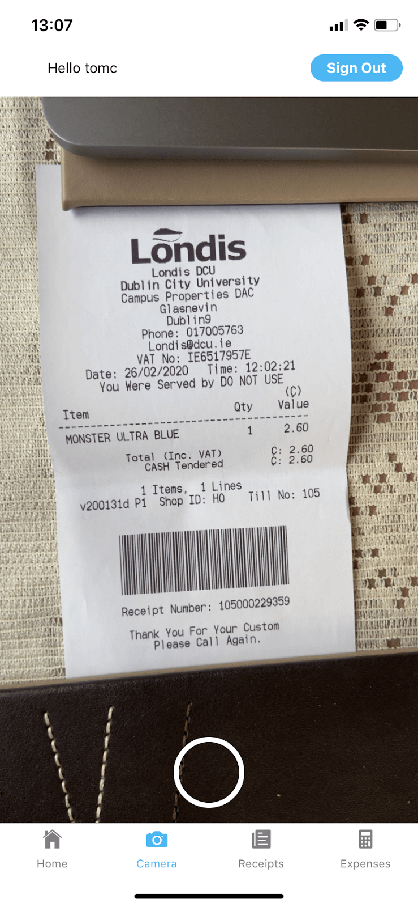

# User Manual

  

### CA326 - 3rd Year Project

Tom Callaghan (16449672)

Karl Duignan (16105982)

### Table of Contents

 - 1 Introduction 
 - 2 Getting Started
	- 2.1 Sign Up
	- 2.2 Sign In
	- 2.3 Forgot Password
	- 2.4 Home Screen 
- 3 Scanning Receipt
	- 3.1 Capture Image	
	- 3.2 Accept / Reject receipt
	- 3.3 Pick category 
- 4 Receipt Management
	- 4.1 Display Receipts
	- 4.2 Display Image
	- 4.3 Delete receipt 
- 5 Expense tracker
	- 5.1 Expense Graphs
	- 5.2 Calendar
	- 5.3 Email Report 
- 6 Sign out
	- 6.1 Sign out button

## 1 Introduction

Welcome to Receiptless. This is an iOS / Android mobile application which assists users in storing their receipts and tracking expenses. Consumers fight the battle of trying to store physical receipts every day. From paper filled wallets to paper filled drawers, this application tries to eliminate this frustrating process for consumers. Another issue that this application targets is the tracking of cash transactions. Consumers use bank statements to track all payments made by card but cannot track their cash payments. ATM withdrawals simply aren't enough to track where the money disappears too.

  

This is an everyday problem for many people and this application is here to help. In this user manual, we will go through the process of storing the receipts and also tracking the expenses. This application uses a number of different processes such as OCR (Optical Character Recognition) and data processing. The application can be used on both android and iOS mobile devices.

  

We are sure that you will find our application both convenient and user-friendly. Please continue reading to learn more about the application and how to get started.

## 2 Getting Started

### 2.1 Sign Up

To begin the user’s journey with Receiptless they must firstly sign up. After installing the App on their respective mobile device, open it up. On the user’s initial startup of the application, they will be prompted with the Sign In screen. From here you may press the “Sign Up” text below the Sign In button. This will then bring you to the Sign Up which will look like the image below.

  

  

From here the user must enter the following:

-   A unique Username of their choice
    
-   A password containing at least 1 uppercase character, 1 numeric character and at least 6 characters in length
    
-   The user’s personal Email
    

Once these have been filled press the SIGN UP button. A confirmation code will then be sent to your above-chosen email. Once this is received by their email account, the user can then press the “Confirm a Code” button. This will then navigate you to the Confirm Sign Up screen illustrated below.

Here is where the user can complete their sign up after completing the previous screen. Using the unique code sent to their email, they will input both their chosen username and the confirmation code sent to them, to confirm and validate the user’s Receiptless account sign up. After entering both fields the “Confirm” button will turn a blue colour and allow you to press it. If the user has entered the correct username and confirmation combination, their sign up will be complete and the user can proceed back to the Sign In screen to login to their newly created

### 2.2 Sign In

The user can access and log into their account on the Sign In screen. An example of this screen can be seen here.

The user may enter their credentials (Username & Password) used when Signing Up to Receiptless. Once these are successfully entered, the user can press the SIGN IN button which will then navigate the user to their HomeScreen

### 2.3 Forgot Password

If the user has forgotten their password for their Receiptless account, this can be reset through the Forgot Password screen. This option is located on the main Sign In screen underneath the SIGN IN button. Once pressed it will bring the user to the Forgot Password screen which looks like the image here:

  

The user can then enter the username of their account in which they forgot the password for and press the SEND button once it is entered. A “forgot password” email with a confirmation code will be sent to the email associated with that particular account/username, if entered correctly. The screen will then change to a different Screen as seen here:

The user can then enter the confirmation code that was sent to their email along with their newly chosen password. After entering both fields the Submit button will change blue and the user can then press it to submit their password reset/change.

### 2.4 Home Screen

After a user successfully signs in to their Receiptless Account they will be brought to the Home Screen as illustrated here:

Here the user can begin their full use of the Receiptless application. On it they will be present with various buttons. These buttons will navigate the user to various screens depending on the option they choose. Each button corresponds as follows

-   Sign Out - Logs the user out and brings them back to the Sign In page
    
-   Scan Receipt - Brings the user to the Camera Screen
    
-   View Receipts - Navigates to the users uploaded Receipts screen
    
-   Track Expenses - Navigates to the expense tracker screen
    

The bottom Navbar (Home, Camera, Receipts, Expenses) can also be used throughout the whole Application to navigate quickly between screens.

  
  
  
  
  
  
  

## 3 Scanning Receipt

### 3.1 Capture Image

After successfully navigating the Camera screen, on the user’s first interaction with this camera they will be prompted to allow or deny permission to their mobile’s camera. The user must ‘Allow’ these permissions if they wish to use the application. The rear camera of the mobile is used to capture images. The user will click the transparent circle to capture the image. The camera is set to autofocus so that the user does not have to click to focus.

  

### 3.2 Accept / Reject receipt

Once the image is captured, the user is then prompted to accept or reject the image. If the image is not clear the user should click Reject and will be brought back to the take picture screen to retake the picture. If the user is happy that the image is of good quality they should press the Accept button.

  
  

### 3.3 Pick category

After accepting the image the user will be prompted to choose a given category. They should choose the category which best corresponds with the receipt type. The user is also able to cancel the process and return to the Camera screen by clicking the “X”. The four categories (Entertainment, Travel, Groceries, Clothes) chosen should cover nearly all receipt types.

  

  

## 4 Receipt Management

  

### 4.1 Display Receipts

Once the user picks a category the data is processed using OCR (Optical Character Recognition) and text processing. The user then navigates to the Receipts screen and is asked to refresh the screen by pulling down. All the receipts for their profile will then be displayed. The three pieces of data that are displayed are the store name, total and date. The chosen category is displayed on the left-hand side of the data.

  

  

### 4.2 Display Image

If the user wants to see the image that was captured for the given receipt, they simply click on the data. The image taken will then be displayed. This can be used to verify that you have the physical receipt. The user can return to the Receipts screen by pressing the close button.

  
  

### 4.3 Delete receipt

If the user wishes to remove/delete the receipt they can simply press on the red delete button. They will be shown the given alert, confirming they want to delete the receipt. Once the user confirms they wish to delete the receipt, the receipt will be deleted from the receipts screen.

  

## 5 Expense tracker

### 5.1 Expense Graphs

Once a user's receipt has successfully uploaded a receipt, the user can then track their expenses. The user will navigate to the Expenses screen, and the graphs will be automatically generated on landing on this screen. There are three different graphs that will be displayed. A bezier line chart is the first that is shown, this displays the expenses for the current week (Monday-Friday). The next chart is a pie chart, this displays the four categories and the percentage of spending per category in the last 30 days.

### 5.2 Calendar

The user can click on the calendar icon on top of the Expenses screen and will be shown the given screen. This is a calendar-based method of tracking your expenses from a given date. For example, if a user is quizzical on how they spent so much money on a certain date they simply click the date and it will display the receipts. If there are no receipts for that given date, “no receipts” message will appear. To navigate back to the Expense screen they will simply press the back button.

  

### 5.3 Email Report

Lastly, the user may want to get a copy of the weekly expenses sent to their email, in order to send a copy onto a boss or colleague for example. The user simply presses the email icon. Once the email is successfully sent to their email the user will be notified to say “Email sent”.

  

## 6 Sign out
### 6.1 Sign out button

If the user wishes to sign out of their account, they can simply press the sign out button in the top right corner of the screen. This is displayed on every screen, to allow the user to sign out at any point.

  

